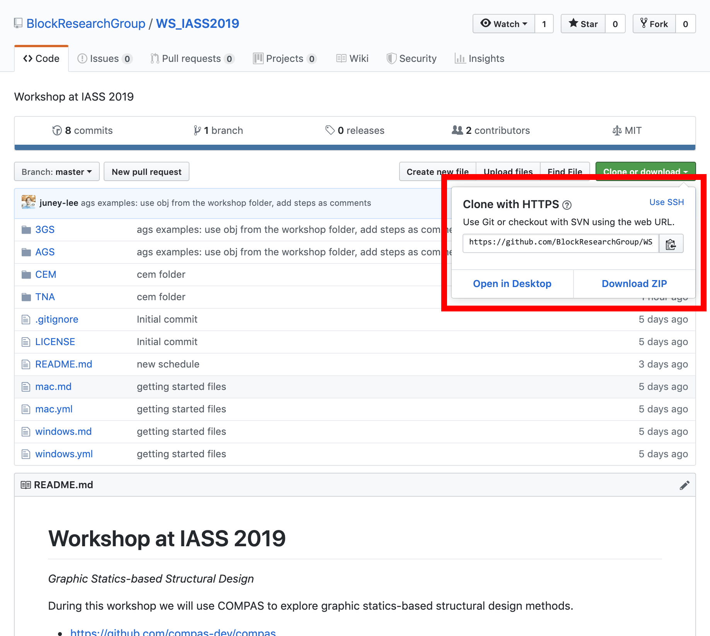
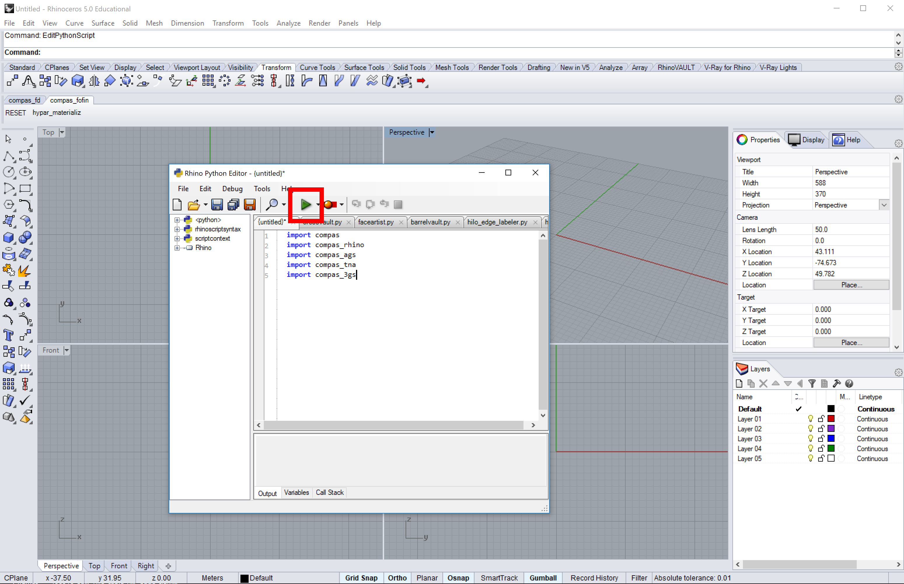

# Workshop at IASS 2019

*Graphic Statics-based Structural Design*

During this workshop we will use COMPAS to explore graphic statics-based structural design methods.

* https://github.com/compas-dev/compas
* https://compas-dev.github.io/main
* https://forum.compas-framework.org/


## Schedule

### Day 1

* Introduction to graphic statics
* Computational graphic statics

*Break*

* Introduction to COMPAS

*Lunch*


1.  Algebraic Graph Statics (AGS): **compas_ags**
    * Introduction
    * Examples

2.  3D Graphic Statics (3GS): **compas_3gs**
    * Introduction
    * Examples

3.  Thrust Network Analysis (TNA): **compas_tna**
    * Introduction
    * Examples and tutorial


### Day 2

4.  Combinatorial Equilibrium Modelling (CEM)
    * Introduction
    * Examples and tutorial


## Getting started

**1. Clean up**

*   If you have an old version of Anaconda installed (for example Anaconda 2), please uninstall it.
*   If you have a version of Python registered on your `PATH`, please remove it (Windows only).

**2. Install required software**

*   [Anaconda 3](https://www.anaconda.com/distribution/)
*   [Rhino](https://www.rhino3d.com/download)
*   [VS code](https://code.visualstudio.com/)

During the installation of the various tools, just accept all default settings.
The default location for installing Anaconda is usually in the home directory.
If it isn't, try to install it there anyway.
And make sure not to register it on the `PATH` (Windows only).
On Windows, the path to the home directory is stored in the variable `%USERPROFILE%`.
On Mac, it is accessible through `~`.
This results in the following recommended installation directories for Anaconda.

*On Windows*

```
%USERPROFILE%\Anaconda3
```

*On Mac*

```
~/anaconda3
```

**If you are using Rhino 5 on Windows, you have to upgrade the built-in IronPython to version `2.7.5`.
Not to the newest version, but to this specific version.**
There are [detailed instructions](https://compas-dev.github.io/main/environments/rhino.html)
in the COMPAS documentation that explain how to do this.


**3. Download repository**

Finally, download the workshop repository to your computer and unzip it.
You should be on the [main repository page](https://github.com/BlockResearchGroup/WS_IASS2019) now.
The download button is green and somewhere on the top right of the page.



Use a sensible location for the download so you can easily find it afterwards.
For example, create a folder called "Workshops" on your home drive and unzip the repository there.

*On Windows*

```
%USERPROFILE%\Workshops\WS_IASS2019
```

*On Mac*

```
~/Workshop/WS_IASS2019
```


## The command line

Many instructions in the next sections will have to be run from "the command line".

On Windows, use the "Anaconda Prompt" instead of the "Command Prompt", and make sure to run it *as administrator*.

> To find the Anaconda Prompt open the Start Menu and type "Anaconda".
> The Anaconda Prompt should already show up in the list of search results.
> To launch is as administrator, right click and select "Run as administrator".

On Mac, use the "Terminal".

**For simplicity, this guide will refer to both Terminal and Anaconda Prompt as "the command line".**


## Installing the workshop repository

We will use the command line to install the COMPAS Python packages (and their dependencies) required for the workshop.

First, navigate to the root folder of the workshop repository (the folder containing the file `windows.yml` or `mac.yml`).
For example, if you used the download path from above, do

*On Windows*

```bash
cd %USERPROFILE%\Workshops\WS_IASS2019
conda env create -f windows.yml
```

*On Mac*

```bash
cd ~/Workshops/WS_IASS2019
conda env create -f mac.yml
```

Finally, verify the installation using an interactive Python session.
Start the session by typing `python` on the command line.
Then try to import the packages that were just installed.

```python
>>> import compas
>>> import compas_ags
>>> import compas_tna
>>> import compas_3gs
>>> exit()
```

## Rhino

If this is the first time you are using Rhino 6 for Windows, or if you have never opened its
PythonScriptEditor before, do so now: open Rhino and open the editor by typing `EditPythonScript`.
Then simply close Rhino again.

To install the COMPAS packages, type the following on the command line

```bash
python -m compas_rhino.install -v 6.0 -p compas compas_rhino compas_ags compas_tna compas_3gs
```

To install COMPAS for Rhino 5 instead, do

```bash
python -m compas_rhino.install -v 5.0 -p compas compas_rhino compas_ags compas_tna compas_3gs
```

To check the installation, launch Rhino, open the PythonScriptEditor, and try
importing the COMPAS packages in a script.
Then run the script and if no errors pop up, you are good to go.

```python
import compas
import compas_ags
import compas_tna
import compas_3gs
```




## compas_tna-UI for Rhino

Use the command line to navigate to the root folder of the UI repository.
For example, if you downloaded or cloned the repo to your home drive, then do the following.

*On Windows*

```bash
cd %USERPROFILE%\compas_tna-UI
```

*On Mac*

```bash
cd ~/compas_tna-UI
```

To install the UI do

```bash
python -m compas_rhino.install_plugin TNA{d8bb2ef6-4539-4ba7-aa48-8ecadb23c229}
```

Note that on Windows, the plugin will be installed for Rhino 6 by default.
If you want to install it for Rhino 5, just do

```bash
python -m compas_rhino.install_plugin -v 5.0 TNA{d8bb2ef6-4539-4ba7-aa48-8ecadb23c229}
```

The plugin will become available next time you start Rhino.

> Sometimes the commands of the plugin only become available after you start the
> PythonScriptEditor. Just type `EditPythonScript` ...

For detailed information about the compas_tna-UI, please visit: https://github.com/BlockResearchGroup/compas_tna-UI


## Interactive drawings

[eQUILIBRIUM](http://block.arch.ethz.ch/eq)

* [Single panel truss](http://block.arch.ethz.ch/eq/drawing/view/36)
* [Funicular line through two points](http://block.arch.ethz.ch/eq/drawing/view/5)
* [Minimum and maximum thrust in a masonry arch](http://block.arch.ethz.ch/eq/drawing/view/16)


## Reading

* [Geometry-based Understanding of Structures](http://block.arch.ethz.ch/brg/publications/399)
* [Algebraic Graph Statics](http://block.arch.ethz.ch/brg/publications/413)
* [Thrust Network Analysis: A new methodology for three-dimensional equilibrium](http://block.arch.ethz.ch/brg/publications/355)
* [On the Equilibrium of Funicular Polyhedral Frames and Convex Polyhedral Force Diagrams](http://block.arch.ethz.ch/brg/publications/444)
* [Computational Design Framework for 3D Graphic Statics](http://block.arch.ethz.ch/brg/publications/897)
